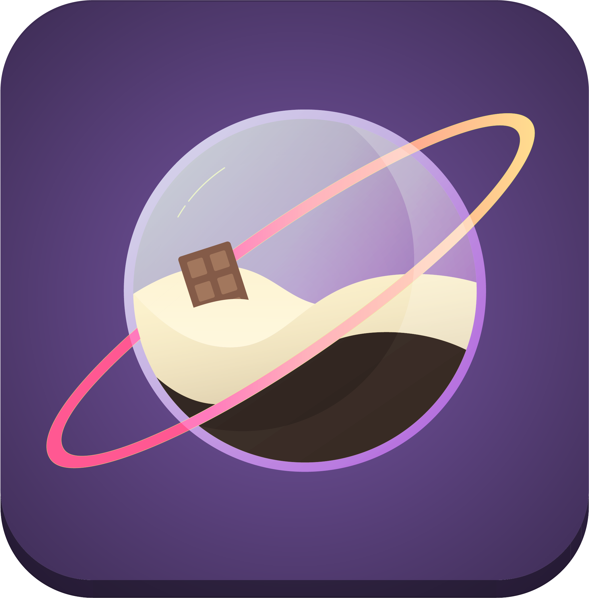

 

  

  <h3 align="center">Sweet World</h3>

  

  Serius Game project
     
    <a href="https://github.com/RicardOP-gdev/SweetWorld"><strong>Explore this repository »</strong></a>
     
     
    <a href="https://github.com/RicardOP-gdev/SweetWorld/tree/main/Scripts">Scripts</a>
    ·
    <a href="https://github.com/RicardOP-gdev/SweetWorld/tree/main/Resources">Resources</a>
  

<!-- PRESENTATION -->
## Description

Sweet World is a project with the purpose of creating a Serious Game for the Museo del Chocolate BCN in which through QR codes the user could unlock a minigame referring to the museum's sculptures. This project was created with Unity3D and C# and uses gyroscope and accelerometer technology to control player. 

In this project I was Lead Programmer and Artist2D to make sprites for the UI and GUI, also create videos about museum information.
